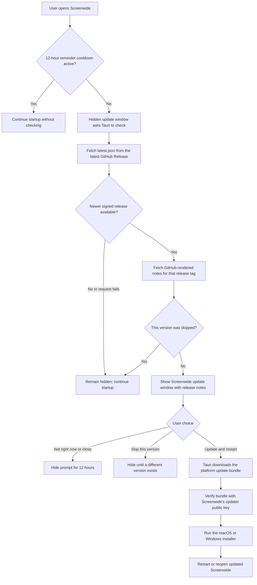

<!--
SPDX-FileCopyrightText: 2026 overpolish
SPDX-License-Identifier: GPL-3.0-or-later
-->

# Releasing Screenwide

Screenwide publishes installers and signed Tauri updater bundles through GitHub
Releases. A pushed version tag builds native Apple Silicon macOS, Intel macOS,
and x64 Windows artifacts. The workflow creates a draft release so the files and
release notes can be checked before users' apps see it.

## User update flow

Screenwide owns the update interface; Tauri does not display a generic native
update dialog. On launch, a hidden Screenwide update window asks Tauri to check
the latest GitHub Release. The window is brought forward only when a new update
is available and the user's reminder or skip preference allows it. **Settings →
About** remains available for a manual check.



The update is never installed merely because a check found one. The prompt shows
the current and new versions, release date, GitHub release notes, and three clear
actions: **Skip this version**, **Not right now**, and **Update and
restart**. Closing the prompt or pressing Escape has the same 12-hour cooldown
as reminding later. After confirmation, the prompt shows download progress.
The changelog is GitHub's sanitized, rendered release description rather than a
second copy embedded in `latest.json`; links open in the system browser.

- On macOS, Tauri replaces the installed application and Screenwide relaunches
  it after installation.
- On Windows, Tauri starts the NSIS installer in `passive` mode. Windows closes
  Screenwide while the installer replaces it; the installer may show its own
  small native progress window.
- Development builds do not contact the update endpoint because `tauri dev`
  launches through a symlink that is unsuitable for safe in-place updates.

The updater metadata and downloads come from the public GitHub Release, but
Tauri accepts an update only when its updater signature matches the public key
embedded in Screenwide. Apple code signing/notarization and Windows
Authenticode signing are separate operating-system trust layers.

## One-time repository setup

Add these GitHub Actions repository secrets:

- `TAURI_SIGNING_PRIVATE_KEY`: the complete contents of the Screenwide updater
  private key. The maintainer copy is at `~/.tauri/screenwide.key`.
- `TAURI_SIGNING_PRIVATE_KEY_PASSWORD`: not required for the current
  unencrypted key. Add it only if the updater key is replaced with an encrypted
  one.
- `APPLE_CERTIFICATE`: a Developer ID Application `.p12` exported from Keychain
  Access and encoded with `openssl base64 -A -in certificate.p12`.
- `APPLE_CERTIFICATE_PASSWORD`: the password used when exporting that `.p12`.
- `APPLE_SIGNING_IDENTITY`: the certificate name reported by
  `security find-identity -v -p codesigning`.
- `APPLE_ID`: the Apple ID used for notarization.
- `APPLE_PASSWORD`: an app-specific password for that Apple ID.
- `APPLE_TEAM_ID`: the Apple Developer Team ID.

The updater public key is intentionally committed in `src-tauri/tauri.conf.json`.
Never commit the private key. Back it up securely: losing it prevents existing
installations from accepting future updates.

Windows installers are updater-signed but not yet Authenticode code-signed, so
Windows may show a SmartScreen reputation warning until a Windows signing
certificate is configured.

## Make a release

1. Update the version in `package.json`, `src-tauri/Cargo.toml`, and
   `src-tauri/tauri.conf.json`.
2. Run `pnpm release:check-version` and `pnpm check`.
3. Commit the version change, then tag and push it:

   ```sh
   git tag v0.2.0
   git push origin v0.2.0
   ```

4. Wait for the Release workflow to finish. In the draft GitHub Release, verify
   both macOS DMGs, the Windows NSIS installer, signed updater bundles, and
   `latest.json`.
5. Edit the generated notes if needed, then publish the draft. Publishing makes
   it the endpoint served by
   `releases/latest/download/latest.json`, so installed copies can offer it.

Do not publish a partially successful release. Rerun failed jobs or delete the
draft and tag, correct the issue, and create a new version.

## Debugging updates

### Preview the interface

Run the isolated update prompt in Storybook without contacting GitHub or
installing anything:

```sh
pnpm update:preview
```

The **Features / Update Prompt** stories cover an available update, installation
at 62%, and an installation failure. Use Storybook's theme control to inspect
both light and dark appearances.

To preview the same interface inside its real native Tauri window, run:

```sh
pnpm dev:updater
```

This uses mock update data. Clicking **Update and restart** switches to the 62%
installation state; closing, reminding, or skipping hides the native window.
Development builds still cannot contact or install from the updater endpoint.

### Exercise a real staged update

The real updater cannot run against `tauri dev`: its macOS debug executable is
launched through a symlink, and Tauri rejects that as an unsafe update target.
Instead, publish a signed GitHub **prerelease** containing a version newer than
the local `package.json`. A draft is insufficient because the application
cannot download draft assets.

Build an older packaged client against that exact prerelease tag:

```sh
pnpm update:staging -- v0.2.0-rc.1
```

This produces an app with:

- the updater endpoint overridden to
  `releases/download/v0.2.0-rc.1/latest.json`;
- updater artifact generation disabled for the older test client;
- updater diagnostics enabled; and
- Tauri's release-build devtools feature enabled.

On macOS the command defaults to an `.app`; on Windows it defaults to an NSIS
installer. Additional `tauri build` options can follow the tag. Launch the
packaged client directly, then open its Web Inspector with
**Command–Option–I** on macOS or **Ctrl–Shift–I** on Windows. Updater decisions
are prefixed with `[Screenwide updater]`.

Reset reminder and skip decisions from the Web Inspector console when repeating
a scenario:

```js
localStorage.removeItem("screenwide.updates.remindAfter");
localStorage.removeItem("screenwide.updates.skippedVersion");
```

Use a prerelease version such as `0.2.0-rc.1` in all three version files and tag
it `v0.2.0-rc.1`. Publish the workflow's draft as a prerelease, then restore the
working tree to an older version before building the staging client. The remote
updater bundle must be signed with the same private key whose public key is
embedded in the client; Tauri does not permit bypassing signature verification.
