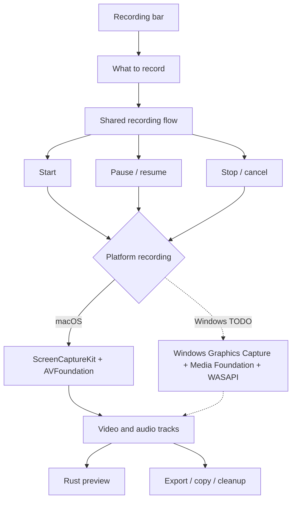
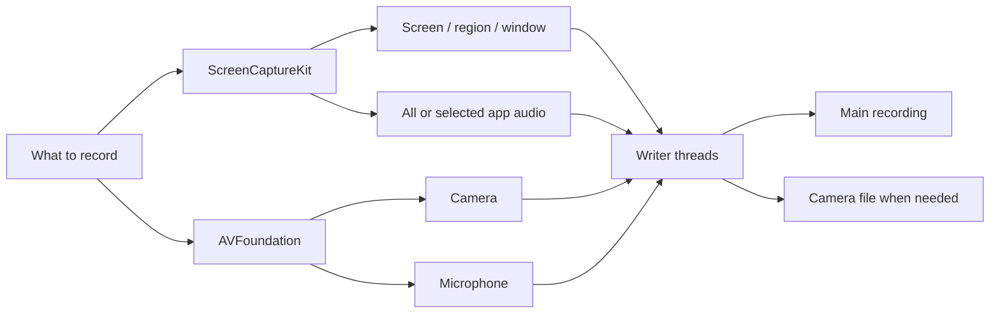

<!--
SPDX-FileCopyrightText: 2026 overpolish
SPDX-License-Identifier: GPL-3.0-or-later
-->

# Recording

## Shared

There is one recording flow for both platforms. It handles:

- modes and selected sources
- start, pause, resume, stop and cancel
- recording state
- working files and cleanup
- timing and export info

The platform part only needs to provide:

- `begin_blocking(config)` to start capture
- `CaptureSession` with pause, resume, stop and cancel
- `CaptureStart` with the first written frame and source scale factor

The platform is picked at compile time. It is not a plugin system.

## macOS

- Screen, region and window use ScreenCaptureKit.
- System audio and selected app audio use ScreenCaptureKit, including audio only mode.
- Camera and microphone use AVFoundation.
- AVAssetWriter writes the files and uses hardware video encoding.
- Camera stays separate unless bake in is enabled on export.
- Microphone stays on its own track so it is easy to edit later.

## Windows

Windows recording is TODO. It will use the same shared flow and implement the platform part with:

- Windows Graphics Capture for screen, region and window
- Media Foundation for camera and hardware encoding
- WASAPI for microphone, system audio and app audio

The recording bar, recording state and export UI should not need Windows versions.
